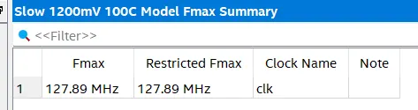
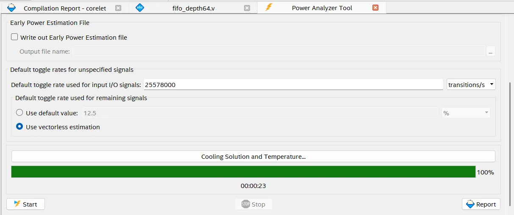
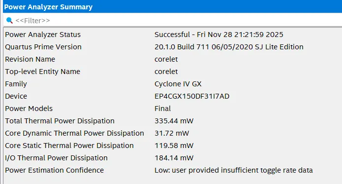

# FPGA Synthesis of Part 1 Corelet

## Frequency

- Slow Fmax at 100C: 127.89 MHz

 

## Power Analyis

- Transition Rate: 25,578,000 transitions/s (Assume 20% transition rate)
- Core Dynamic Power Dissipation: 31.72 mW
- Core Static Thermal Power Dissipation: 119.58 mW
- OPS/s: 64 MACs * 2 ops/MAC * 127.89 $\times 10^6$ cycles / s  = 16,369,920,000 OPS/s = 16.36992 GOPS/s
- OPS/W = 16.36992 GOPS/s / 0.03172 W = 516.08 GOPS/W
- 
- 