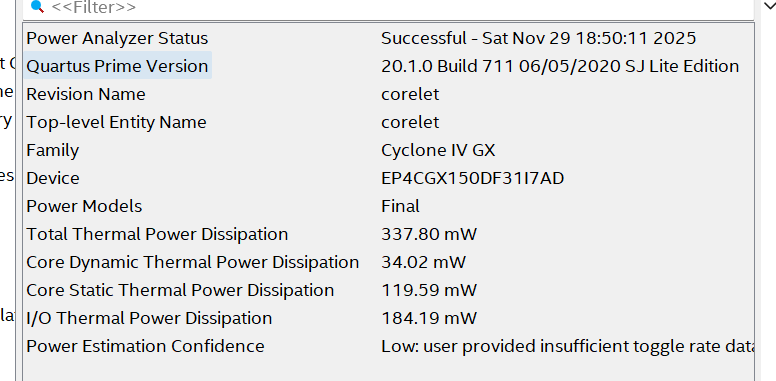
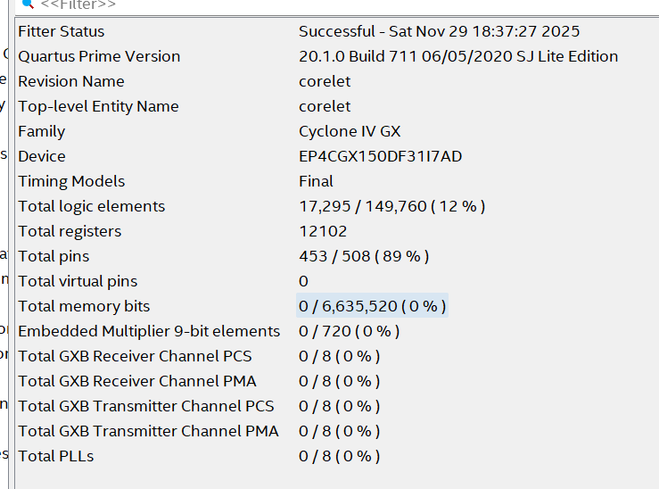

# Part 1 Synthesis Results

## Frequency and Performance

- **Frequency at Slow Corner, 100C**: 128.17 MHz

- **Operations/Sec**: 64 MACs/cycle * 2 ops / MAC * 128.17 * $10^6$ cycles / sec = 16.406 GOPS/s

## Power

- **Dynamic Thermal Power**: 34.02 mW
- **Static Thermal Power**: 119.59 mW
- **Total Thermal Power**: 337.8 mW
- **I/O Thermal Power Dissipation**: 184.19 mW
- **Operations/W**: 482.2 GOPS/W 

## Size

- **Total Logic Elements**: 17,295 / 149,760 (12%)
- **Total Registers**: 12102
- **Total pins**: 453/508 (89%)

